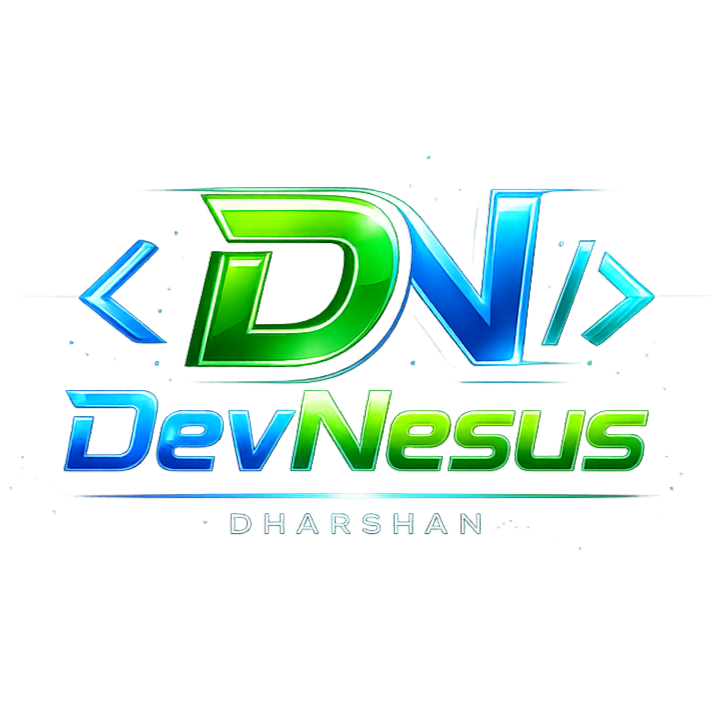

<p align="center">
  
</p>

<h1 align="center">DevNexus — Developer Portfolio</h1>

<p align="center">
  A modern, dark-themed developer portfolio built with <strong>React</strong>, <strong>Vite</strong>, and <strong>Tailwind CSS</strong>.<br/>
  Fast, responsive, and beautifully animated.
</p>

<p align="center">
  
  
  
</p>

---

## ✨ Features

- 🌑 **Dark Theme** — Sleek, modern dark UI with glassmorphism effects
- 🎯 **Smooth Animations** — Scroll-reveal effects and micro-interactions
- 📱 **Fully Responsive** — Mobile-first design, tested on 320px–1920px
- 📄 **Resume Download** — One-click PDF resume download
- 📬 **Contact Form** — Working form powered by Formspree
- ⚡ **Lightning Fast** — Vite-powered build with optimized performance

---

## 🛠️ Tech Stack

| Category | Technology |
|---|---|
| **Framework** | React 19 |
| **Build Tool** | Vite 7 |
| **Styling** | Tailwind CSS 4 |
| **Fonts** | Inter (Google Fonts) |
| **Form Handling** | Formspree |
| **Deployment** | Vercel |

---

## 🚀 Getting Started

### Prerequisites

- [Node.js](https://nodejs.org/) (v18 or higher)
- npm or yarn

### Installation

```bash
# Clone the repository
git clone https://github.com/dhxrshanr-ai/Portfolio.git
cd Portfolio

# Install dependencies
npm install

# Start development server
npm run dev
```

The app will be running at `http://localhost:5173`.

### Build for Production

```bash
npm run build
npm run preview   # Preview the production build
```

---

## 📁 Project Structure

```
Portfolio/
├── public/
│   ├── icon.png          # Favicon
│   └── resume.pdf        # Downloadable resume
├── src/
│   ├── components/
│   │   ├── Navbar.jsx    # Navigation bar with mobile menu
│   │   ├── Hero.jsx      # Landing section
│   │   ├── About.jsx     # About me section
│   │   ├── Skills.jsx    # Skills & technologies
│   │   ├── Projects.jsx  # Featured projects
│   │   ├── Resume.jsx    # Resume section
│   │   ├── Contact.jsx   # Contact form
│   │   └── Footer.jsx    # Footer
│   ├── data/
│   │   ├── projects.js   # Project data
│   │   └── skills.js     # Skills data
│   ├── hooks/
│   │   └── useScrollReveal.js
│   ├── App.jsx
│   ├── main.jsx
│   └── index.css
├── index.html
├── vite.config.js
├── package.json
└── .gitignore
```

---

## 📬 Contact

**Dharshan** — Frontend Developer from Theni, Tamil Nadu

- 📧 Email: [dhxrshanr@gmail.com](mailto:dhxrshanr@gmail.com)
- 💼 LinkedIn: [dharshanr6](https://www.linkedin.com/in/dharshanr6/)
- 🐙 GitHub: [dhxrshanr-ai](https://github.com/dhxrshanr-ai)

---

## 📄 License

This project is open source and available under the [MIT License](LICENSE).
